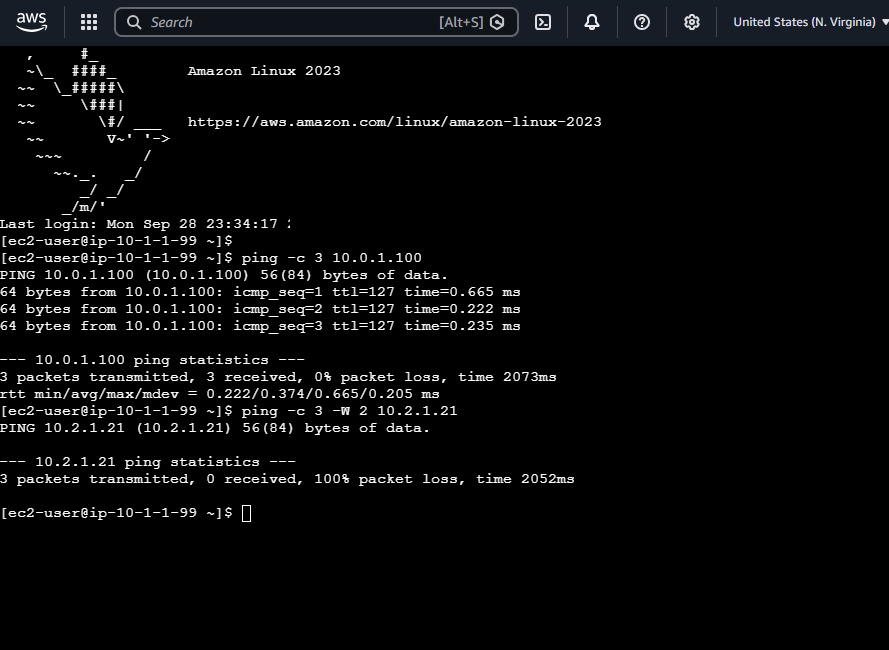

# AWS Hub-and-Spoke Network (VPC Peering, $0)

A hub-and-spoke network on AWS built with Terraform.
Dev and Prod VPCs can reach a Shared services VPC, but **not each other**, because VPC peering is non-transitive.

## Architecture

| VPC    | CIDR        | Private subnet |
|--------|-------------|----------------|
| Shared | 10.0.0.0/16 | 10.0.1.0/24    |
| Dev    | 10.1.0.0/16 | 10.1.1.0/24    |
| Prod   | 10.2.0.0/16 | 10.2.1.0/24    |

Peering: `shared <-> dev`, `shared <-> prod`. No `dev <-> prod` link.

## Design decisions

- **VPC peering over Transit Gateway:** no hourly cost. At 10+ VPCs, Transit Gateway scales better.
- **No IGW / NAT Gateway:** private-only network, $0.
- **Single AZ:** avoids cross-AZ data transfer charges (a production design would use 2+ AZs).
- **Reusable `modules/vpc`:** one module, three environments.

## Usage

```bash
terraform init
terraform plan
terraform apply
terraform destroy   # always clean up
```

## Proof: isolation test

From the **dev** instance (reached privately via EC2 Instance Connect Endpoint, no public IP, no SSH keys):

| Test | Result |
|------|--------|
| dev -> shared (`10.0.1.100`) | 3/3 received, 0% loss |
| dev -> prod (`10.2.1.21`) | 0/3 received, 100% loss |

Prod's security group **allows** ping from `10.0.0.0/8`, so the failure comes from **routing** (no dev <-> prod peering, peering is non-transitive), not the firewall.



## Security

- Private subnets only, no public IPs
- Access via EC2 Instance Connect Endpoint (no bastion, no SSH keys stored)
- IMDSv2 required, encrypted EBS volumes
- Least-privilege security groups (SSH only from the endpoint)

## Roadmap

- [x] Phase 1: VPCs, subnets, route tables, peering
- [x] Phase 2: EC2 test instances + security groups
- [x] Phase 3: Connectivity tests (dev -> shared works, dev -> prod fails)
- [ ] Phase 4: VPC Flow Logs

Test instances are toggled off after testing to stay at $0:

```bash
terraform apply -var="create_test_instances=false"
```
